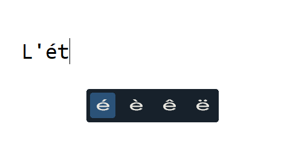
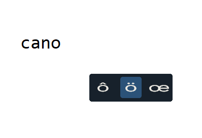

<p align="center">
    
</p>

## About



**Altccents** is an utility that offers an alternative way to type accented characters. The utility is designed for **_qwerty_** keyboard layout and originally supports french accented characters.

There are several programs that perform a similar tasks. But none of them fully suit my specific needs. That project was inspired by [QuickAccent](https://aka.ms/PowerToysOverview_QuickAccent).

## Features

-   Type accented characters without changing the keyboard layout
-   Select accents by using "**Accent control key**"(Num Lock by default)
-   Manage and monitor utility state using tray icon

## How to use

Altcents supports accents for the following characters:

| **Char** | **Key** |
| :------: | :-----: |
|    A     |    A    |
|    E     |    E    |
|    I     |    I    |
|    O     |    O    |
|    U     |    U    |
|    C     |    C    |
|    Y     |    Y    |
|    €     |    '    |

All controls are built around "**Accent control key**"(Num Lock).

To type accent hold down **Num Lock** and press character key. For example, if you want to type _ö_, press and hold **Num Lock** and press **o** 2 times.



To turn on/off altccents there is a shortcut: **Win + Shift + Num Lock**.
You can also manage altccents by interacting with the **tray icon**.

## Installation

1. Download [Altccents](https://github.com/Clovis1444/altccents/releases/latest)
2. Unzip **Altccents.zip** into any directory
3. Run **add_to_startup.bat** as administrator to add **Altccents.exe** to startup. Alternatively, create a shortcut to **altcents.exe** in "%APPDATA%\Microsoft\Windows\Start Menu\Programs\Startup\".

## Configuration

Currently, Altccents does not support custom configuration. But you can change values of global variables in **_src/config.rs_** and build program by the following command:

```
cargo build --release
```
